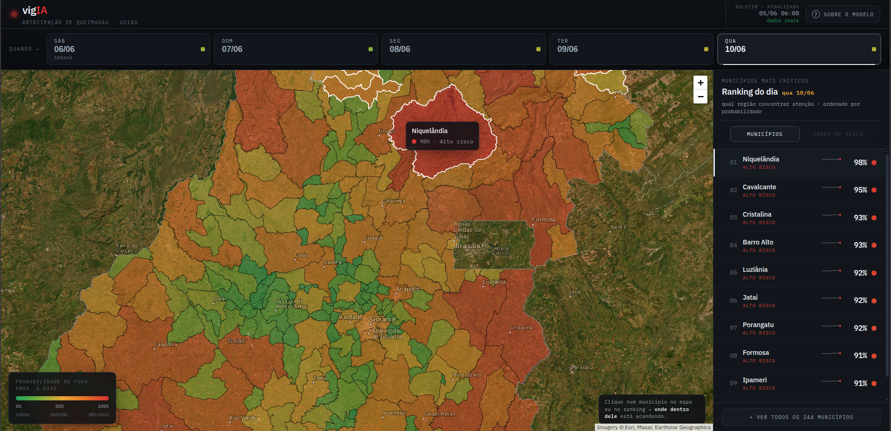

# vigIA
Repositório da disciplina FGA0083 — Aprendizado de Máquina | UnB 2026-1 | Turma 01 | Grupo 3

> Mapa interativo de previsão de risco de queimadas nos próximos 5 dias para o estado de Goiás.

---

## Grupo
- Felipe de Jesus Rodrigues — 211062867
- João Paulo Barros de Cristo — 202023805
- Guilherme Aguera de la Fuente Vilela — 190088168
- Luiz Guilherme Morais da Costa Faria — 231011696

---

## Rodando

O frontend é um app estático (HTML + JS + CSS), sem build. Basta servir a pasta `frontend/` com qualquer servidor HTTP local:

```bash
cd vigIA/frontend
python3 -m http.server 8000
```

Abrir no navegador: **http://localhost:8000**

> **Atenção:** abrir `index.html` diretamente como `file://` não funciona — o navegador bloqueia o fetch do `forecast.json`. Use sempre um servidor HTTP.

---

## Screenshot do APP



---

## Estrutura

```
frontend/
├── index.html        página principal
├── app.js            lógica do mapa e interações
├── data.js           carregamento e parse do forecast
├── styles.css        estilos
└── forecast.json     boletim de previsão (atualizado pelo pipeline)
```

---

## Atualizando o boletim

O `forecast.json` incluído no repositório contém a previsão mais recente gerada pelo pipeline. Para atualizar com dados novos, a partir da raiz do projeto:

```bash
cd pbl
python3 exportar_json.py
```

O script lê os CSVs mais recentes de `pbl/resultados/` e salva o boletim em `vigIA/frontend/forecast.json`. A documentação completa do pipeline está no repositório principal.
